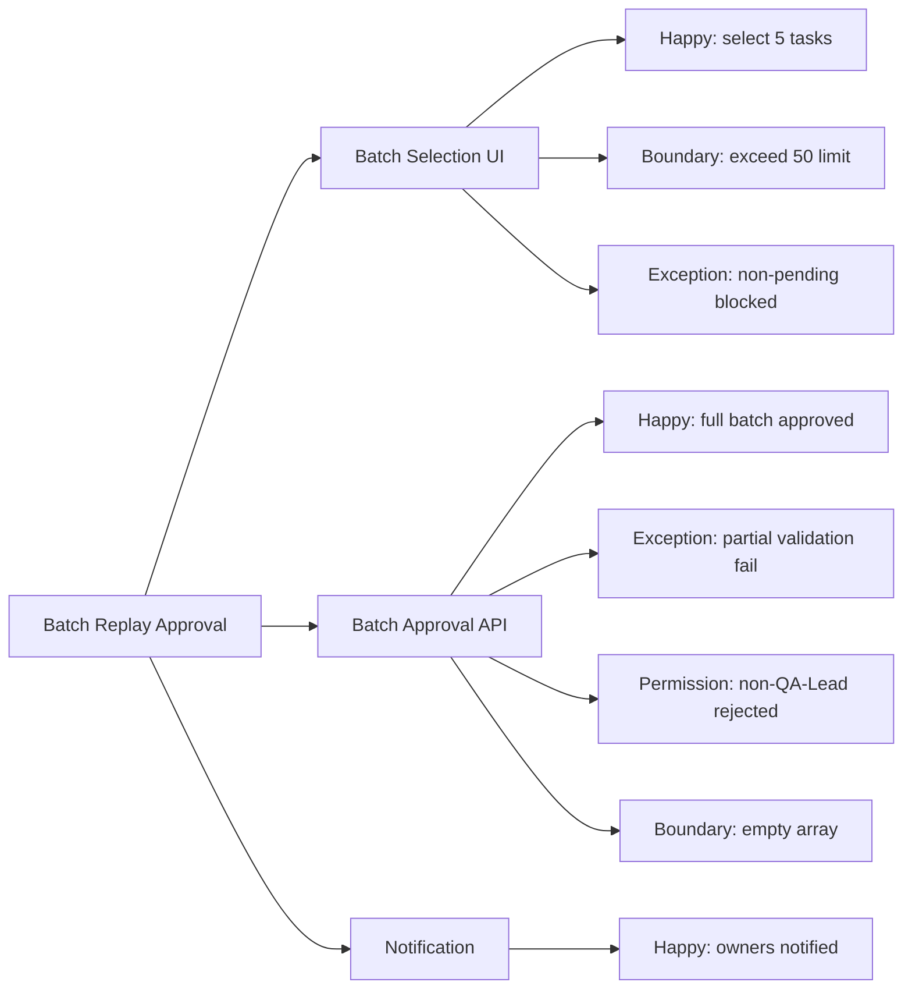

# Sample Mindmap

## Context

Generated from the "Batch Replay Approval" test design scope.

## Mermaid Code

## Rendering Notes

- Use `flowchart LR` for guaranteed left-to-right layout.
- First level: modules (match PRD analysis decomposition).
- Second level: scenarios prefixed with type (Happy/Exception/Boundary/Permission).
- Keep labels under 40 characters for readability.
