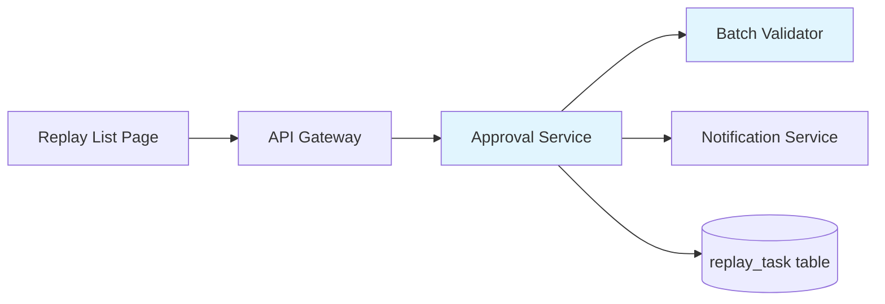
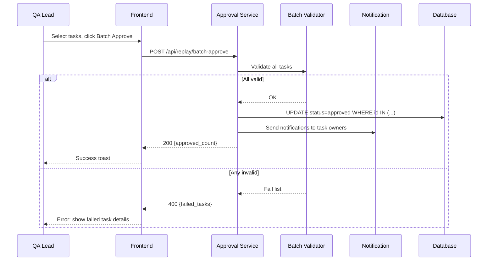

# Sample Technical Review Document

## PRD Source

"Add batch replay approval for QA Lead role, max 50 tasks, atomic validation."

---

## 1. Overview

- **Background**: QA Leads currently approve replay tasks one by one, causing friction for large test runs.
- **Objective**: Add batch approval to reduce manual effort; enforce atomic validation.
- **Scope**: Backend API, frontend replay list page, notification service.

## 2. Architecture Changes



- **New**: `BatchValidator` component within Approval Service.
- **Modified**: Approval Service gains a new batch endpoint.
- **Unchanged**: Notification Service (existing push channel reused).

## 3. API Protocol

### POST /api/replay/batch-approve

**Request**:
```json
{
  "task_ids": [101, 102, 103],  // Required. Max 50 items.
  "comment": "Batch approved for sprint 23"  // Optional.
}
```

**Response (success)**:
```json
{
  "code": 0,
  "data": {
    "approved_count": 3,
    "approved_ids": [101, 102, 103]
  }
}
```

**Response (validation failure)**:
```json
{
  "code": 400100,
  "message": "Batch validation failed",
  "data": {
    "failed_tasks": [
      {"id": 102, "reason": "Task is not in pending state"}
    ]
  }
}
```

**Auth**: Requires `qa_lead` role. Returns 403 for other roles.

## 4. Flow Diagram



## 5. Database Design

No new tables. Existing `replay_task` table modification:

| Column | Type | Change | Description |
|--------|------|--------|-------------|
| batch_approve_id | varchar(32) | ADD | Groups tasks approved in the same batch |
| approved_at | timestamp | ADD | Timestamp of approval |

**Index**: `idx_batch_approve_id` on `batch_approve_id` for batch query.

**Migration**: ALTER TABLE, nullable columns, no backfill needed.

## 6. Key Technical Changes

- **Atomic validation**: Use database transaction; if any task fails validation, rollback all.
- **Batch size limit**: Enforce max 50 at API layer (return 400 if exceeded).
- **Notification fanout**: Async via message queue; do not block the approval response.

## 7. Security & Compliance

| Category | Implementation |
|----------|---------------|
| AuthZ | Check `qa_lead` role from JWT claims before processing |
| Input validation | Validate task_ids: array, max 50, all positive integers |
| Rate limiting | Max 10 batch approvals per minute per user |
| Audit | Log batch approval events with operator, task IDs, timestamp |

## 8. Non-Functional Considerations

- **Latency**: p99 < 500ms for batch of 50 (validation + DB update).
- **Concurrency**: Optimistic lock on task status to prevent double-approval.
- **Monitoring**: Alert if batch failure rate > 20% in 5-minute window.
- **Rollback**: Feature flag `batch_approval_enabled`; disable returns 404 on new endpoint.

## 9. Test Strategy

- Unit: Validator logic (valid/invalid states, boundary at 50).
- Integration: Full API call with DB, verify atomicity.
- E2E: Frontend selection + approval + notification delivery.
- See `mirrorsphere-test-design` skill for detailed test cases.

## 10. Timeline & Risk

| Milestone | Estimate |
|-----------|----------|
| API + Validator | 2 days |
| Frontend batch selection UI | 1 day |
| Notification integration | 0.5 day |
| Testing + QA | 1.5 days |

**Risks**:
- DB lock contention under high concurrency → mitigate with optimistic locking.
- Notification queue backlog → mitigate with dead letter queue and retry.
