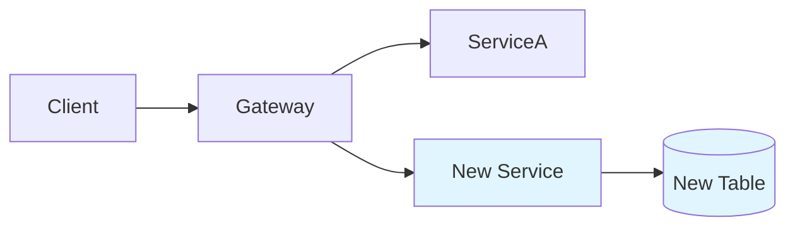
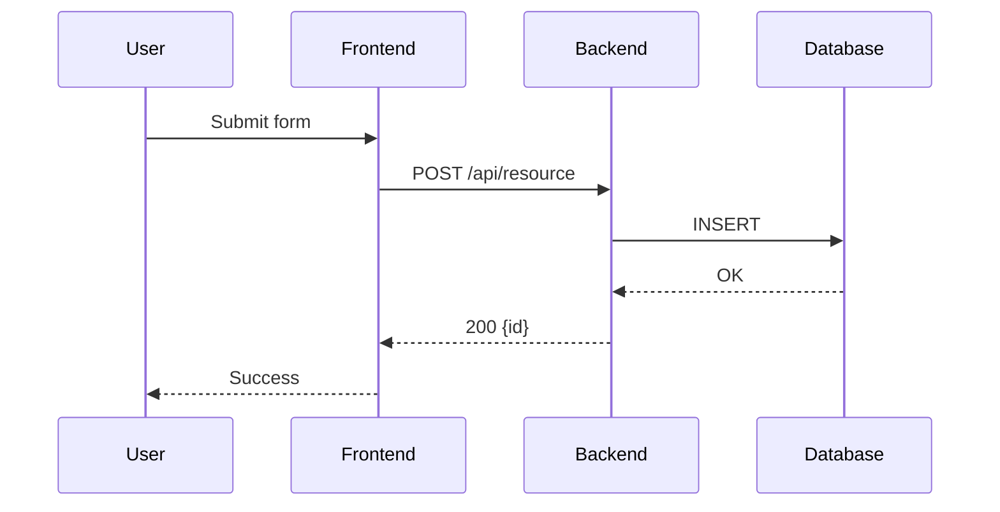

# Technical Review Document Generation Guide

## Purpose

Generate a structured technical review document from a parsed PRD, providing
implementation-ready specifications for the engineering team.

## Principles

### 1. Traceability

Every technical decision should trace back to a PRD requirement. If a section
has no corresponding requirement, mark it as "Inferred" and explain the reasoning.

### 2. Precision

- API protocols: use exact JSON schemas, not prose descriptions.
- Database design: specify types, constraints, and indexes.
- Flow diagrams: use Mermaid syntax for reproducible diagrams.

### 3. Completeness

Cover all sections defined in SKILL.md. If a section is not applicable to the
current PRD, state "Not applicable for this change" with a brief reason.

### 4. Actionability

The document should be sufficient for a developer to begin implementation without
needing to re-read the PRD for technical decisions.

## Section Guidelines

### Architecture Changes

- Use `flowchart LR` or `flowchart TD` for system diagrams.
- Highlight new components with different styling.
- Show data flow direction with labeled arrows.

### API Protocol

- List all endpoints that are new or modified.
- Include request/response JSON with inline comments.
- Specify HTTP method, content type, and auth requirements.
- Document error codes specific to this feature.

### Flow Diagrams

Use `sequenceDiagram` for interactions between systems:

### Database Design

- Always include: column name, type, nullable, default, description.
- Specify primary key, unique constraints, and foreign keys.
- List indexes with their purpose (query pattern they optimize).
- Estimate row count growth rate if relevant.

### Security & Compliance

Consider these categories:

| Category | Check |
|----------|-------|
| AuthN/AuthZ | Who can access? How is identity verified? |
| Input validation | What could be malicious? Size limits? |
| Data sensitivity | PII? Encryption at rest/transit? |
| Rate limiting | What prevents abuse? |
| Audit trail | What operations need logging? |

### Non-Functional

- State concrete numbers: "p99 latency < 200ms" not "should be fast".
- Describe monitoring: what metrics, what thresholds trigger alerts.
- Rollback: how to disable the feature without a deployment.

## Output Quality Checklist

Before presenting the document:

- [ ] Every API has request + response + error codes.
- [ ] Every new table has full column definitions.
- [ ] Architecture diagram shows all affected components.
- [ ] At least one flow diagram for the main path.
- [ ] Security section is not empty.
- [ ] No placeholder text like "TBD" or "TODO" (ask the user instead).
